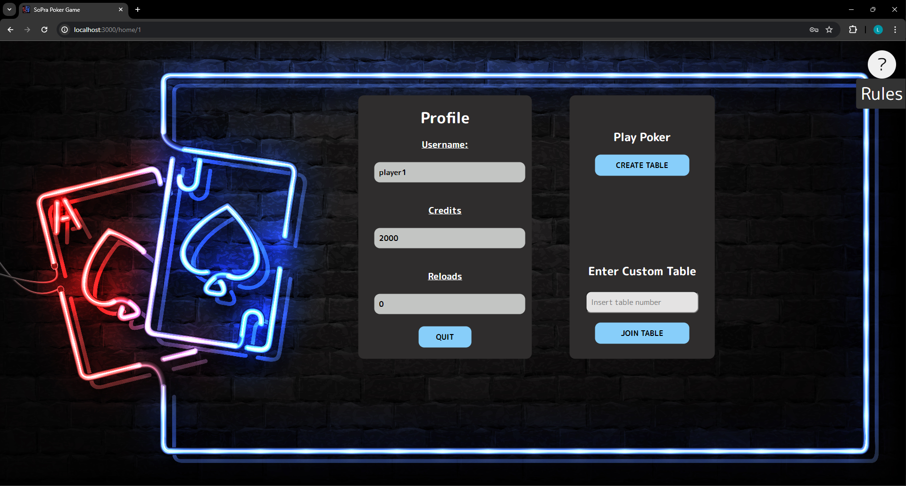

# SoPra Group 5 Project: Poker
## Introduction
Welcome to our project; A free, user-friendly online poker game. This game allows friends to connect, compete, and enjoy poker without the distractions and limitations of other online alternatives.

Our whole team is a big fan of the game of poker. Therefore, it was clear we wanted to create a poker game. But what would make our poker game special? We wanted to create a game where friends could play poker together, whenever and wherever they are. Despite the plethora of online options, finding a satisfactory platform to play poker with friends can be difficult. Most online poker games are cluttered with ads, require in-app purchases, or are just not user friendly.

By eliminating ads and unnecessary costs, we ensure that our platform is accessible to everyone, making it easy to start a game of poker and practice some new strategies or just have fun with your friends.

## Technologies used:
The client part has been implemented using React.js.

- **React.js**: A JavaScript library for building user interfaces, allowing for the creation of reusable UI components.
- **Node.js**: A JavaScript runtime used for running the development server and building the application.
- **REST**: RESTful APIs are used to communicate between the front-end and back-end services.
- **Google Cloud**: The application is deployed to Google Cloud, ensuring scalability and reliability.

## High-level components:
### User Interface Components
- **[Login Component](https://github.com/sopra-fs24-group-03/sopra-fs24-group-03-client/blob/main/src/components/views/Login.tsx)**: Manages the user login and authentication process. Allows users to log in with their existing account or create a new one.
- **[Home Component](https://github.com/sopra-fs24-group-03/sopra-fs24-group-03-client/blob/main/src/components/views/Home.tsx)**: The main view of the application, displaying the user's profile and options to join a game or create a new one.
- **[Lobby Component](https://github.com/sopra-fs24-group-03/sopra-fs24-group-03-client/blob/main/src/components/views/Lobby.tsx)**: Manages the display of the lobby and its players. Functions as a waiting room for players to join the game.
- **[Game Table Component](https://github.com/sopra-fs24-group-03/sopra-fs24-group-03-client/blob/main/src/components/views/Table.tsx)**: Displays the poker table and handles user interactions during the game.


### Styles
- **[SCSS Stylesheets](https://github.com/sopra-fs24-group-03/sopra-fs24-group-03-client/tree/main/src/styles)**: Located in `src/styles`, the stylesheets are used to style the UI components.
    - **[Views](https://github.com/sopra-fs24-group-03/sopra-fs24-group-03-client/tree/main/src/styles/views)**: Contains specific styles for individual view components such as the table, lobby or homescreen, located in `src/styles/views`.
    - **[UI](https://github.com/sopra-fs24-group-03/sopra-fs24-group-03-client/tree/main/src/styles/ui)**: Contains general styles for buttons and other UI elements, located in `src/styles/ui`.

### Routing
- **[React Router](https://github.com/sopra-fs24-group-03/sopra-fs24-group-03-client/tree/main/src/components/routing)**: Used for declarative routing in the application. It allows navigation between different views such as the lobby, game table, and user profile. Located in `src/components/routing`.

## Launch & Deployment:
1. **Install Dependencies**: Make sure you have Node.js and npm installed. Then, run:
    ```bash
    npm install
    ```

2. **Run the Application Locally**: Start the development server with:
    ```bash
    npm start
    ```

3. **Build for Production**: Create a production build with:
    ```bash
    npm run build
    ```

4. **Deployment to Google Cloud**: Follow these steps to deploy the application:
    - Set up a Google Cloud project and enable the necessary APIs.
    - Build the Docker image for your React app and push it to Google Container Registry.
    - Use Google Cloud Run to deploy the containerized app.

## Illustrations:
### USer Flow
1. **Login**: Users can log in with their existing account or create a new one.
2. **Home**: The main view of the application, displaying the user's money, his reloads and options to join a game or create a new one.
3. **Lobby**: The waiting room for players to join the game. If the user is the host, he can start the game as well as kick players.
4. **Game Table**: The table where the game is played. The user can fold, call, raise, or check. After one playing round all users are redirected to the lobby and the earings and losses are distributed.

### Screenshots
#### Login

#### Home

#### Lobby

#### Game Table


## Roadmap:
- **Buy back retries with money**: Implement a feature where players can buy back `reloads` with in-game currency.
- **Clickable player names**: Make player names clickable to view their profile overview.
- **Optimize UI by adding a "stats" feature**: Enhance the gametable view to show:
    - Username of the current player's turn
    - Current bet in the game
    - How much the player last raised
    - The player's current hand with the available cards on the table
    - Who is the Small Blind (SB) and Big Blind (BB)
    - Other relevant statistics
- **Add animation for chips**: Display chips on the table with animations instead of just showing their integer value.


## Authors and Acknowledgments:
### Authors
- Joel Huber - Backend and Frontend - [joelhube](https://github.com/joelhube)
- Cèdric Huber - Backend and Frontend - [cedihube](https://github.com/cedihuber)
- Linus Lautenschlager - Frontend - [Lilololl](https://github.com/Lilololl)
- Noah Ziegler - Backend - [N-oahh](https://github.com/N-oahh)
- Colin Bächtold - Backend - [Colbae](https://github.com/Colbae)

## License:
This project is licensed under the GNU General Public License - see the [LICENSE](LICENSE) file for details.
